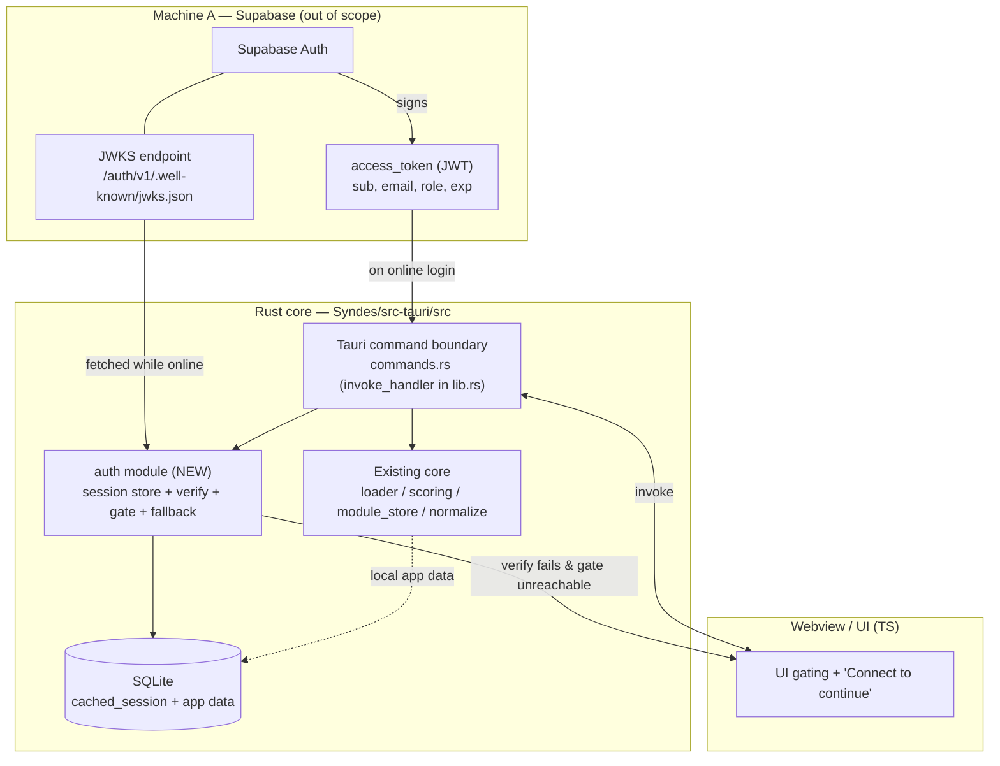
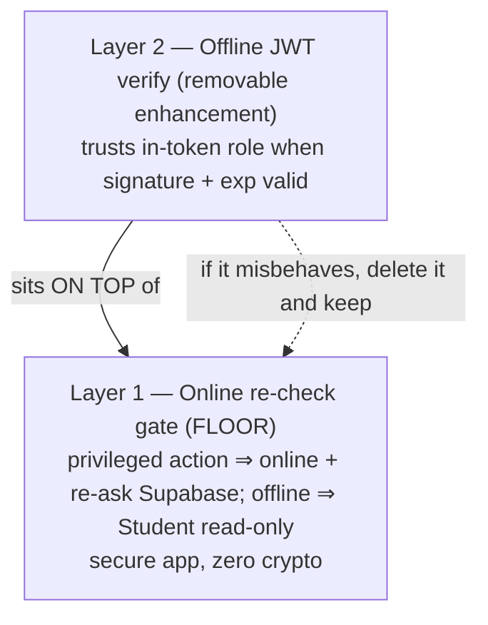
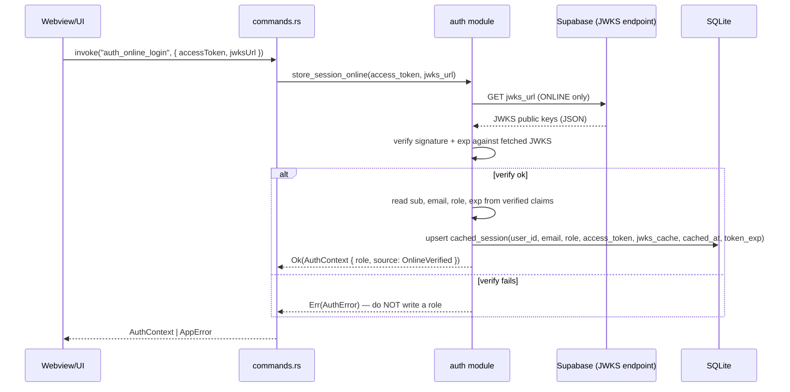

# Design Document: SQLite Local Session Cache

> Authoritative source: `docs/SPEC_B_sqlite_local.md` (SPEC B — SQLite Local).
> Input contract (the seam): the companion `docs/Spec A — Supabase (Postgres).md`.
> This design integrates with the existing offline-first Rust core under
> `Syndes/src-tauri/src` (loader, scoring, module_store, normalize, model,
> commands) and the Tauri v2 command boundary wired in `lib.rs`. It does **not**
> introduce a parallel stack.

## Overview

SQLite on this machine does exactly one security-relevant thing and one
housekeeping thing. The security-relevant thing: it **caches** a role that
Supabase already decided, so the app keeps working offline after a single online
login. The housekeeping thing: it owns genuinely-local app data (quiz modules,
attempts, scores, drafts) that the Rust core already manages. SQLite never
*decides* a role.

The whole design exists to close one leak: SQLite lives on the user's device, so
anyone can open the file and set `role = 'admin'`. The defence is that the role
column is treated as a **cache, never an authority**. A role is only ever trusted
when the signed Supabase JWT that accompanies it verifies — signature first, then
`exp`, then and only then the role claim *inside* the token. The loose `role`
string is a convenience for display; the signature is the proof.

Everything is layered so the demo-safe thing ships first. The floor is an
**online re-check gate** (any privileged action requires being online and
re-asks Supabase; offline everyone is Student-scoped read-only) — a secure app
with zero crypto. On top of that floor we layer **offline JWT verify** as a
removable enhancement that enables trusted offline roles. If that layer
misbehaves, it can be deleted and the online gate still stands. The grace
fallback always fails **toward more verification, never less**: a failed verify
drops to the stricter online gate, and an unreachable gate drops to
read-only — it must never fall back to trusting the raw `role` column, because
that fails *open* and reopens the leak.

### What this machine owns vs. what it does not

| In scope (Machine B) | Out of scope (Machine A / Supabase) |
| --- | --- |
| Local SQLite schema: `cached_session` + local app-data tables | Assigning / deciding roles |
| Rust offline JWT verify path (signature + `exp` against cached JWKS) | Running OAuth / login |
| Fetch + cache JWKS while online | Writing RBAC rules |
| Store token after a successful online login | Issuing / signing the JWT |
| Modular build order (online gate → JWT verify layer → removable) | Minting the JWKS |
| Grace fallback (verify fail → stricter gate → read-only) | |

---

## Architecture



The `auth` module is a **new sibling** to the existing core modules. It owns the
`cached_session` table, JWKS fetch/cache, offline verify, the online re-check
gate, and the fallback chain. It is wired through the same Tauri command boundary
pattern (`commands.rs` + `invoke_handler` in `lib.rs`) and reuses the existing
typed-error style (`AppError`-shaped). The existing loader/scoring/module_store
path is untouched; local app-data tables simply gain a persistent SQLite home.

### Layering (the build order, visualised)



---

## Sequence Diagrams

### Online login (seam write): store token + cache JWKS



### App start / privileged action (offline verify + grace fallback)

```mermaid
sequenceDiagram
    participant UI as Webview/UI
    participant CMD as commands.rs
    participant AUTH as auth module
    participant DB as SQLite
    participant SB as Supabase (online gate)

    UI->>CMD: invoke("auth_resolve_role", { requirePrivileged })
    CMD->>AUTH: resolve_access(require_privileged)

    Note over AUTH: Layer 2 — offline JWT verify
    AUTH->>DB: load cached_session
    AUTH->>AUTH: parse jwks_cache; verify_jwt(access_token) (signature + exp)
    alt signature + exp valid
        AUTH-->>CMD: Ok(AuthContext { role = in-token role, source: OfflineVerified })
    else verify fails (bad sig / expired / skew / missing JWKS)
        Note over AUTH: Grace fallback — drop to the STRICTER layer
        AUTH->>SB: online re-check gate (requires connection)
        alt gate reachable
            SB-->>AUTH: fresh role decision
            AUTH-->>CMD: Ok(AuthContext { role, source: OnlineGate })
        else gate unreachable (offline)
            AUTH-->>CMD: Ok(AuthContext { role: Student, readOnly: true, source: StudentReadOnly })
            CMD-->>UI: "Connect to continue" + Student-scoped read-only
        end
    end
    Note over AUTH: NEVER returns a role from the loose cached_session.role column alone
```

---

## Components and Interfaces

### Component 1: `auth::session_store` (SQLite access)

**Purpose**: Owns the `cached_session` table and local app-data persistence.
The only module that reads/writes `cached_session` rows. Loading a session hands
back the raw stored bytes (token + JWKS) — it performs **no** trust decision.

**Interface** (Rust):

```rust
/// Raw cached session as stored on disk. This is UNTRUSTED input: the `role`
/// field is a convenience string copied from a once-verified token and may have
/// been tampered with on-device. Nothing may branch on `role` here.
pub struct CachedSession {
    pub user_id: String,
    pub email: String,
    pub role: String,       // CACHE ONLY — never trusted without verify()
    pub access_token: String, // the signed Supabase JWT = source of role truth
    pub jwks_cache: String,   // Supabase public keys fetched while online
    pub cached_at: i64,       // unix seconds
    pub token_exp: i64,       // from the JWT 'exp' claim
}

pub trait SessionStore {
    /// Load the single cached session, if one exists. Returns the raw row with
    /// NO verification applied.
    fn load_cached_session(&self) -> Result<Option<CachedSession>, AuthError>;

    /// Upsert the session. Called ONLY after a successful online verify
    /// (see `auth::seam`). Writing here without a prior verify is forbidden.
    fn store_cached_session(&self, session: &CachedSession) -> Result<(), AuthError>;

    /// Clear the cached session (logout / corruption recovery).
    fn clear_cached_session(&self) -> Result<(), AuthError>;
}
```

**Responsibilities**:
- Create / migrate the `cached_session` table and confirm local app-data tables.
- Load and store rows verbatim; never interpret `role`.
- Keep SQLite access behind one module so no other code reads `role` directly.

### Component 2: `auth::verify` (the trusted layer — Layer 2)

**Purpose**: Offline JWT verification. Given the stored token and cached JWKS,
check the signature and expiry, then return the role claim **from inside the
token**.

**Interface** (Rust):

```rust
#[derive(Clone, Copy, PartialEq, Eq)]
pub enum Role { Student, Teacher, Admin }

/// Claims we read ONLY after signature + exp are verified.
pub struct VerifiedClaims {
    pub sub: String,     // user uuid
    pub email: String,   // verified email
    pub role: Role,      // the trusted role (in-token, not the loose column)
    pub exp: i64,        // unix seconds
}

pub trait JwtVerifier {
    /// Verify signature against the JWKS public key AND check exp against the
    /// device clock. Returns the in-token claims only on full success. ANY
    /// failure (bad signature, expired, clock skew, malformed, missing key)
    /// is an `Err` — there is no partial-trust return.
    fn verify_jwt(&self, access_token: &str, jwks_cache: &str) -> Result<VerifiedClaims, AuthError>;
}
```

**Responsibilities**:
- Parse JWKS JSON into usable public keys.
- Verify the JWT signature (Rust `jsonwebtoken` crate or similar) and `exp`.
- Return the role **only** from verified claims; never from `CachedSession.role`.

### Component 3: `auth::gate` (the floor — Layer 1)

**Purpose**: The online re-check gate. Any privileged action requires being
online and re-asks Supabase. Offline, callers are Student-scoped read-only.

**Interface** (Rust):

```rust
pub enum GateOutcome {
    /// Online, Supabase re-confirmed the role for a privileged action.
    Confirmed(Role),
    /// Could not reach Supabase — caller must drop to read-only Student scope.
    Unreachable,
}

pub trait OnlineGate {
    /// Online re-check. Requires a live connection; offline ⇒ `Unreachable`.
    fn recheck(&self, access_token: &str) -> GateOutcome;
}
```

**Responsibilities**:
- Enforce privileged actions online, independent of any crypto.
- Report `Unreachable` offline so the fallback can drop to read-only.

### Component 4: `auth::seam` (JWKS fetch + login write)

**Purpose**: The input seam with Spec A. Fetches + caches JWKS while online and
persists the session after a verified online login.

**Interface** (Rust):

```rust
pub trait AuthSeam {
    /// ONLINE login write: fetch JWKS from `jwks_url`, verify the token against
    /// the fresh keys, and only on success persist `cached_session`. Returns the
    /// verified role. Never writes a role on verify failure.
    fn store_session_online(&self, access_token: &str, jwks_url: &str)
        -> Result<AuthContext, AuthError>;
}
```

**Responsibilities**:
- Fetch + cache JWKS **while online** so offline verify has keys.
- Store the token + `token_exp` in `cached_session` after a successful verify.

### Component 5: `auth` orchestrator + Tauri commands

**Purpose**: Compose verify → gate → read-only into the grace fallback and
expose it through the command boundary, matching the existing `commands.rs`
style.

**New Tauri commands** (registered in `invoke_handler` in `lib.rs`):

```rust
/// Online login seam write. Fetch+cache JWKS, verify, persist session.
#[tauri::command]
pub fn auth_online_login(access_token: String, jwks_url: String, /* state */)
    -> Result<AuthContext, AppError>;

/// Resolve the caller's effective access: offline verify first, then the
/// grace fallback (online gate → read-only Student). Used on app start and
/// before any privileged action.
#[tauri::command]
pub fn auth_resolve_role(require_privileged: bool, /* state */)
    -> Result<AuthContext, AppError>;

/// Explicit logout: clear cached_session.
#[tauri::command]
pub fn auth_logout(/* state */) -> Result<(), AppError>;
```

**Responsibilities**:
- Wire the fallback chain in exactly one place so it cannot drift.
- Surface typed errors in the existing `AppError` shape (add `AuthError`
  variants or map into `AppError`).

---

## Data Models

### Model 1: `cached_session` (SQLite table)

Populated **only** after a successful online login + verify (`auth::seam`).
Single-row-per-user cache.

```sql
create table cached_session (
  user_id       text primary key,
  email         text not null,
  role          text not null check (role in ('student','teacher','admin')),
  access_token  text not null,        -- signed Supabase JWT (SOURCE OF ROLE TRUTH)
  jwks_cache    text not null,        -- Supabase public keys, fetched while online
  cached_at     integer not null,     -- unix seconds
  token_exp     integer not null      -- from the JWT 'exp' claim
);
```

**Validation / trust rules**:
- `role` is a **cache, not an authority**. It is written only from a verified
  token, and read loose it is NEVER trusted on its own.
- No code path may branch on `cached_session.role` without first verifying
  `access_token`. (Enforced by routing all reads through `auth::verify`.)
- A row exists only after one successful online verify; absence ⇒ treat as
  no session (Layer 1 floor applies).

### Model 2: Local app-data tables (owned by the Rust core, unchanged)

Quiz modules (JSON), attempts, scores, drafts — the offline-first content the
core already handles via loader / scoring / module_store. These gain a durable
SQLite home but their ownership and shape are unchanged by this spec.

```sql
-- Illustrative; shapes follow the existing core (spec 00/04). Owned by the Rust
-- core, NOT by the auth layer. No role authority lives here.
-- modules(id text primary key, json text not null, ...)
-- attempts(...), scores(...), drafts(...)
```

**Validation rules**:
- App-data tables carry no auth authority; they never store or read a role for
  trust decisions.

### Model 3: `AuthContext` (command return / IPC payload)

```rust
/// What a resolved access decision looks like to the UI. camelCase at the IPC
/// boundary to match the existing command payload convention (spec 01).
#[derive(Serialize)]
#[serde(rename_all = "camelCase")]
pub struct AuthContext {
    pub role: Role,          // effective role to scope the UI
    pub read_only: bool,     // true in the Student-read-only fallback
    pub source: AuthSource,  // provenance of this decision (see below)
}

#[derive(Serialize)]
#[serde(rename_all = "camelCase")]
pub enum AuthSource {
    OnlineVerified,    // Layer 2 at login time
    OfflineVerified,   // Layer 2 at app start / privileged action
    OnlineGate,        // Layer 1 fallback confirmed online
    StudentReadOnly,   // offline + unverifiable ⇒ "Connect to continue"
}
```

### Model 4: `AuthError` (typed failures)

```rust
/// Typed, legible auth failures, mirroring the existing AppError style
/// (serde tag="kind"). Every verify failure maps to one of these — never a
/// panic, never a silent trust.
#[derive(Debug, Clone, Serialize)]
#[serde(tag = "kind", content = "message", rename_all = "camelCase")]
pub enum AuthError {
    NoCachedSession(String),
    JwksParseError(String),
    SignatureInvalid(String),
    TokenExpired(String),     // includes clock-skew-driven expiry
    MalformedToken(String),
    MissingJwks(String),
    StorageError(String),     // SQLite I/O
    NetworkError(String),     // JWKS fetch / online gate
}
```

---

## Algorithmic Pseudocode

### Main algorithm: resolve effective access (verify → grace fallback)

```rust
// The single place the fallback chain lives. Fails TOWARD more verification.
fn resolve_access(require_privileged: bool) -> AuthContext {
    // --- Layer 2: offline JWT verify (the trusted layer) ---
    match verify_cached_role() {
        Ok(role) => {
            return AuthContext { role, read_only: false, source: OfflineVerified };
        }
        Err(_verify_failed) => {
            // Bad signature / expired / clock skew / missing JWKS — ALL land here.
            // Grace fallback: drop to the STRICTER layer, never a looser one.
        }
    }

    // --- Layer 1 fallback: online re-check gate (stricter: needs connection) ---
    let session = load_cached_session_opt();
    if let Some(s) = session {
        match online_gate_recheck(&s.access_token) {
            GateOutcome::Confirmed(role) => {
                return AuthContext { role, read_only: !require_privileged_ok(role, require_privileged),
                                     source: OnlineGate };
            }
            GateOutcome::Unreachable => { /* fall through to read-only */ }
        }
    }

    // --- Floor: offline + unverifiable ⇒ Student-scoped read-only ---
    // "Connect to continue". NEVER returns the loose cached_session.role here.
    AuthContext { role: Role::Student, read_only: true, source: StudentReadOnly }
}
```

**Preconditions**:
- SQLite is reachable; a `cached_session` row may or may not exist.
- `require_privileged` indicates whether the caller is attempting a
  privileged (Teacher/Admin write) action.

**Postconditions**:
- Returns an `AuthContext` whose role is justified by one of: a verified token
  (offline or online-login), an online gate re-check, or the read-only floor.
- NEVER returns a role sourced from `cached_session.role` without a signature
  verification or a live online gate confirmation.
- On every verify failure the result is at least as strict as the online gate;
  when the gate is unreachable the result is strictly read-only Student scope.

**Loop invariants**: N/A (no loops; a fixed strict-descending ladder).

### Function: `verify_cached_role` (the trusted check)

```rust
// Pseudocode shape from SPEC B §4 — the shape, not the final code.
fn verify_cached_role() -> Result<Role, AuthError> {
    let session = load_cached_session()?;          // raw row; role here is UNTRUSTED
    let keys    = parse_jwks(&session.jwks_cache)?; // JwksParseError on failure
    // verify_jwt checks signature AGAINST keys and exp AGAINST the device clock.
    let claims  = verify_jwt(&session.access_token, &keys)?; // SignatureInvalid / TokenExpired
    Ok(claims.role) // trust ONLY the in-token role, never session.role
}
```

**Preconditions**:
- A `cached_session` row exists (else `NoCachedSession`).
- `jwks_cache` holds the keys fetched while online.

**Postconditions**:
- Returns a `Role` **only** when the signature is valid AND `exp` has not passed
  on the device clock.
- The returned role is the token's `role` claim, never `session.role`.
- Any failure returns a typed `AuthError`; no role is returned on failure.

**Clock-skew caution**: offline, the device clock is the only truth. If the token
expired or the clock drifted, `verify_jwt` returns `TokenExpired` and the caller
falls through to the grace fallback. Spec A deliberately sets a generous token
lifetime (days) to keep this from biting mid-demo, but the fallback must still
handle a failed verify gracefully (it does — it drops to the online gate, then to
read-only).

### Function: `store_session_online` (seam write, online only)

```rust
fn store_session_online(access_token: &str, jwks_url: &str) -> Result<AuthContext, AuthError> {
    let jwks_json = http_get(jwks_url)?;              // ONLINE; NetworkError on failure
    let keys      = parse_jwks(&jwks_json)?;          // JwksParseError
    let claims    = verify_jwt(access_token, &keys)?; // verify BEFORE writing anything

    // Only now — after a successful verify — do we persist the cache.
    store_cached_session(&CachedSession {
        user_id:      claims.sub,
        email:        claims.email,
        role:         role_to_str(claims.role), // cache the string for display only
        access_token: access_token.to_string(), // the proof travels with the role
        jwks_cache:   jwks_json,                 // so offline verify has keys
        cached_at:    now_unix(),
        token_exp:    claims.exp,
    })?;

    Ok(AuthContext { role: claims.role, read_only: false, source: OnlineVerified })
}
```

**Preconditions**: online; `jwks_url` is the Supabase JWKS endpoint.
**Postconditions**: a `cached_session` row is written **iff** the token verified
against freshly fetched keys; on any failure nothing is written and no role is
returned.

---

## Key Functions with Formal Specifications

### `verify_jwt(access_token, jwks_cache) -> Result<VerifiedClaims, AuthError>`

- **Preconditions**: `access_token` and `jwks_cache` are the stored strings
  (may be malformed — that is an expected failure, not a precondition violation).
- **Postconditions**:
  - Returns `Ok(claims)` **iff** the signature verifies against a JWKS key AND
    `claims.exp >= device_now()`.
  - On signature mismatch ⇒ `SignatureInvalid`; on past `exp` ⇒ `TokenExpired`;
    on unparseable token ⇒ `MalformedToken`; on unparseable/empty keys ⇒
    `JwksParseError` / `MissingJwks`.
  - No side effects; reads nothing from SQLite; never panics.
- **Loop invariants**: when iterating candidate JWKS keys, no key is trusted
  until its signature check passes; a non-matching key never widens trust.

### `resolve_access(require_privileged) -> AuthContext`

- **Preconditions**: SQLite reachable.
- **Postconditions**: result strictness is monotonic — offline-verified
  (loosest allowed, but still proven) ≥ online-gate ≥ read-only; the function
  never returns a role weaker-than-proven, and never a role sourced from the
  loose column alone.
- **Loop invariants**: N/A.

### `store_cached_session(session) -> Result<(), AuthError>`

- **Preconditions**: caller has just completed a successful verify
  (`auth::seam` is the only caller).
- **Postconditions**: exactly one `cached_session` row reflects the verified
  token; `token_exp` equals the token's `exp` claim; no plaintext secrets are
  logged.

---

## Example Usage

```rust
// App start: resolve what the UI may do, offline-first.
let ctx = resolve_access(/* require_privileged = */ false);
match ctx.source {
    AuthSource::OfflineVerified => render_for(ctx.role),           // trusted offline role
    AuthSource::OnlineGate      => render_for(ctx.role),           // re-confirmed online
    AuthSource::StudentReadOnly => show_connect_banner_read_only(),// "Connect to continue"
    AuthSource::OnlineVerified  => render_for(ctx.role),
}

// A Teacher attempts a privileged write while the JWT layer is healthy.
let ctx = resolve_access(/* require_privileged = */ true);
if ctx.read_only { block_with_connect_prompt(); } else { allow_write(ctx.role); }
```

```rust
// Online login (the seam write): verify THEN cache.
let ctx = store_session_online(&access_token, JWKS_URL)?;
assert!(matches!(ctx.source, AuthSource::OnlineVerified));
```

```ts
// UI side (TS), mirroring the existing invoke<...> convention.
const ctx = await invoke<AuthContext>("auth_resolve_role", { requirePrivileged: false });
if (ctx.readOnly) showConnectToContinue();
else scopeUiTo(ctx.role);
```

---

## Correctness Properties

### Property 1: No trust without proof

For every returned `AuthContext` with
`source ∈ {OfflineVerified, OnlineVerified}`, there exists a token whose
signature verified and whose `exp ≥ device_now()`; the role equals the
in-token `role` claim, never `cached_session.role`.
`∀ ctx. ctx.source ∈ {OfflineVerified, OnlineVerified} ⟹ verified(token) ∧ ctx.role = token.role`.

**Validates: Requirements 2.4, 3.4, 3.5, 4.3**

### Property 2: Fail toward more verification

On any verify failure, the result is
the online gate (requires connection) or stricter; it is never the loose
cached role. `verify_fails ⟹ result ∈ {OnlineGate, StudentReadOnly}`.

**Validates: Requirements 6.1, 6.2, 6.5**

### Property 3: Offline floor is read-only

When verify fails and the online gate is
unreachable, `read_only = true ∧ role = Student`.

**Validates: Requirements 5.5, 6.3**

### Property 4: Never fail open

There is no execution path where
`source` derives a privileged role from `cached_session.role` without a
signature verify or a live online-gate confirmation.

**Validates: Requirements 4.1, 4.4, 6.4**

### Property 5: Write-after-verify

`cached_session` is written only within
`store_session_online`, and only after `verify_jwt` returns `Ok`.

**Validates: Requirements 2.3, 2.5**

### Property 6: Removable layer

Removing `auth::verify` (Layer 2) leaves the online
gate (Layer 1) as the sole enforcement, and the app still resolves access
(every privileged action requires online; offline ⇒ Student read-only).

**Validates: Requirements 5.1, 5.7**

---

## Error Handling

### Scenario 1: Tampered `role` column
- **Condition**: User edits `cached_session.role` to `'admin'` in a SQLite browser.
- **Response**: Verify path ignores the column entirely and reads the role from
  the signed token. The tampered string never influences a decision.
- **Recovery**: None needed — the attack is a no-op by construction (P1, P4).

### Scenario 2: Signature invalid / malformed token
- **Condition**: Token was altered, or JWKS no longer matches.
- **Response**: `SignatureInvalid` / `MalformedToken` ⇒ grace fallback to online
  gate.
- **Recovery**: Online gate re-checks; if unreachable, read-only Student scope.

### Scenario 3: Token expired / clock skew
- **Condition**: `exp` passed on the device clock, or the clock drifted.
- **Response**: `TokenExpired` ⇒ grace fallback to online gate.
- **Recovery**: Online re-login refreshes the token; generous Spec A lifetime
  minimises mid-demo expiry.

### Scenario 4: Missing / unparseable JWKS
- **Condition**: `jwks_cache` empty or corrupt (e.g., login happened without a
  completed JWKS fetch).
- **Response**: `MissingJwks` / `JwksParseError` ⇒ grace fallback to online gate.
- **Recovery**: Re-fetch JWKS on the next online login.

### Scenario 5: SQLite unavailable / corrupt
- **Condition**: DB file missing, locked, or corrupt.
- **Response**: `StorageError`; treated as "no session" ⇒ Layer 1 floor.
- **Recovery**: Recreate schema; next online login repopulates `cached_session`.

### Scenario 6: Online gate unreachable
- **Condition**: Verify failed and the device is offline.
- **Response**: `read_only = true`, role `Student`, UI shows "Connect to continue".
- **Recovery**: Reconnect and retry the privileged action.

---

## Testing Strategy

### Unit testing approach
- `verify_jwt`: valid token ⇒ `Ok` with in-token role; tampered signature ⇒
  `SignatureInvalid`; expired `exp` ⇒ `TokenExpired`; malformed token ⇒
  `MalformedToken`; empty/garbled JWKS ⇒ `MissingJwks`/`JwksParseError`.
- Tampered-column test: a `cached_session` with `role='admin'` but a token whose
  claim is `student` ⇒ resolved role is `student` (the column is ignored).
- `resolve_access`: table-drive each branch (offline-verified, verify-fail +
  gate-confirmed, verify-fail + gate-unreachable) and assert the `source` and
  strictness.
- `store_session_online`: verify-fail ⇒ nothing written; verify-ok ⇒ one row
  with `token_exp == claim.exp`.

### Property-based testing approach
- **Library**: `proptest` (Rust).
- **P1/P4 (no fail-open)**: for arbitrary `cached_session.role` strings paired
  with a token whose claim is a *generated* role, the resolved role (when
  verify succeeds) always equals the token claim and never the column.
- **P2 (strict fallback)**: for arbitrary verify-failure causes, the result is
  always in `{OnlineGate, StudentReadOnly}`.
- **P6 (removable layer)**: with Layer 2 disabled, every privileged resolution
  offline yields read-only Student.

### Integration testing approach
- End-to-end offline flow mirroring the existing `lib.rs` e2e test: online login
  (store token + JWKS) → kill network → app start resolves `OfflineVerified` →
  advance device clock past `exp` → resolve drops to online gate → still offline
  → read-only Student + "Connect to continue".
- Confirm no code path outside `auth::verify`/`auth::gate` branches on
  `cached_session.role` (grep-level and review gate, matching the spec checklist).

---

## Security Considerations

- **Threat model**: the SQLite file is attacker-writable on-device. The only
  authority is the signed JWT; the role column is display convenience. All trust
  flows through `verify_jwt`.
- **Fail-closed by construction**: every fallback step is strictly stronger than
  the one above it; there is no path to a privileged role from the loose column.
- **Secret handling**: never log the `access_token`, JWKS material, or decoded
  claims; follow the existing core's non-sensitive-logging convention
  (`commands.rs` fallback breadcrumbs). The token is a bearer credential at rest
  in SQLite — treat the DB file as sensitive.
- **JWKS freshness**: JWKS is cached while online; stale keys only ever cause
  verify to *fail* (fail-closed), never to over-trust.
- **Clock trust**: offline, the device clock is the sole expiry truth; drift
  causes fail-closed `TokenExpired`, handled by the fallback.

## Performance Considerations

- Verify runs on app start and before privileged actions — infrequent, so a
  synchronous verify (no async runtime pulled into the command boundary, matching
  the core's existing synchronous command style) is acceptable.
- `cached_session` is single-row; reads are O(1). JWKS parse is small and can be
  cached in memory per process if profiling warrants.

---

## Dependencies

- **New (Rust)**: a JWT verification crate (`jsonwebtoken` or similar) for
  signature + `exp` checks against JWKS; a SQLite access crate (e.g., `rusqlite`,
  or a Tauri SQL plugin) for `cached_session` + local app-data persistence.
- **Reused**: `serde` / `serde_json` (already present) for claims/JWKS;
  `reqwest` (already present, `blocking` + `rustls-tls`) for the online JWKS fetch
  and online gate — reuse rather than adding a second HTTP client.
- **Existing core**: integrates via the Tauri command boundary (`commands.rs`,
  `invoke_handler` in `lib.rs`) and the typed-error convention (`AppError`); does
  not modify loader / scoring / module_store / normalize.

### The seam with Spec A (input contract)

Received from Machine A:

```
access_token (JWT), signed by Supabase, claims:
  sub   = user id (uuid)
  email = verified email
  role  = 'student' | 'teacher' | 'admin'
  exp   = generous expiry (days)
JWKS URL = https://<project>.supabase.co/auth/v1/.well-known/jwks.json  (confirm exact path)
```

This machine's seam responsibilities: fetch + cache JWKS **while online** so
offline verify has keys; store the token in `cached_session` after a successful
online login; verify the signature offline and trust **only** the in-token role.
