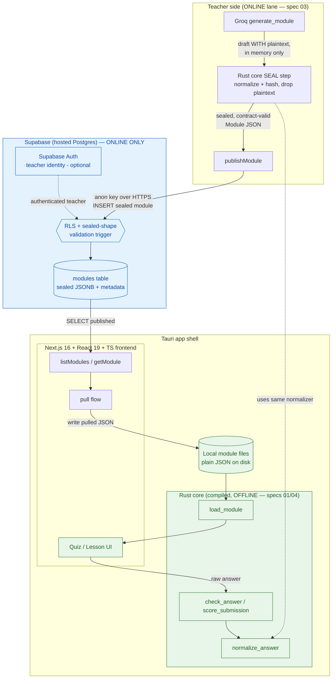
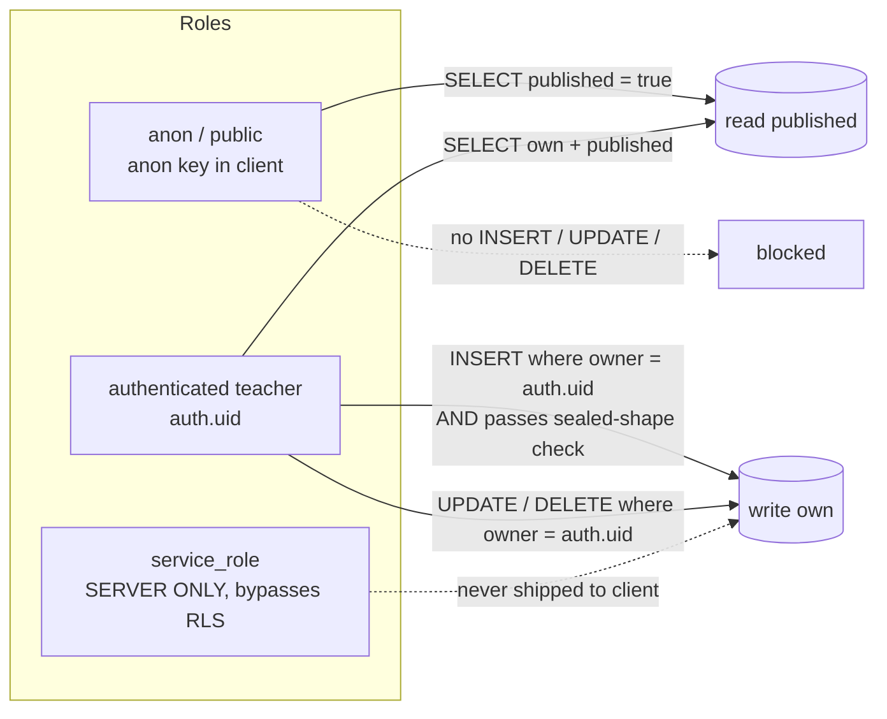

# Design Document: Supabase Database (Online Module Store)

## Overview

Supabase (hosted Postgres) is Acassist's **online-only database layer** for already-sealed,
contract-valid modules. It sits **alongside** the teacher side and is **never** part of the
student scoring path. Teachers publish sealed modules to Supabase; an online device can browse
and pull them; once pulled, a module is a plain JSON file that scores fully **offline** through
the unchanged Rust core (specs 01/04).

This design honors four hard invariants carried over from specs 00, 01, 03, and 04, which are
already built and on `main`:

1. **Offline path untouched.** `load_module` / `check_answer` / `score_submission` /
   `normalize_answer` make no network calls and do not depend on Supabase. Scoring works with
   the radio off. Supabase is never in the scoring path.
2. **No plaintext answers, ever** (spec 00 R2 / spec 03 R2). Only already-sealed modules are
   stored — each question carries `salt` + `answer_hash` only. The DB layer never receives or
   stores a `DraftModule` (which carries plaintext). Sealing happens in the Rust core *before*
   anything is published, and the design makes publishing an unsealed module structurally
   impossible (server-side shape check + client type that only accepts a `Module`).
3. **Contract-valid only** (spec 00). Stored modules match `module.schema.json`:
   `schema_version "1.0"`, `module{id,type,title,subject?,grade_level?}`, optional
   `lesson{blocks[]}`, `quiz{hash_algo:"SHA-256", normalization:"lowercase|trim|collapse-ws|strip-punct", questions[]}`
   with `question{id,kind,prompt,options?,salt,answer_hash,points}`. Three kinds:
   `multiple_choice`, `identification`, `true_false`.
4. **Online-only / teacher-side.** This is the "easy case" online lane (spec 03 R5). It is never
   a dependency of the demo's offline path. A device with no connection simply uses
   locally-held modules.
5. **Client-side sealing only.** Sealing happens in the Rust core on the teacher's device; the
   plaintext answer never crosses a network boundary; there is no server-side sealing. Supabase
   stores only sealed modules and is never a secrecy mechanism — consistent with the thesis's
   honest "tamper-resistant, not unbreakable" framing.

The design is split into a **High-Level** part (architecture, components, data model, RLS policy
model, no-plaintext guarantee) and a **Low-Level** part (SQL DDL, concrete RLS policies, the
server-side sealed-shape validation function/trigger, client-side TypeScript data-access
signatures, and publish/browse/pull flows in pseudocode).

---

# High-Level Design

## Architecture

Supabase is a **detour off to the side** of the sacred offline path. Publishing writes into it;
browsing/pulling reads from it; but scoring never touches it. Once a module is pulled to local
disk, the entire quiz round-trip is the same compiled Rust core path that already exists.



**Reading of the diagram.** The green subgraph is the offline path and never has an arrow into
the blue Supabase subgraph. The only link between the two worlds is `PULL -> LOCAL`: Supabase's
job ends the moment a sealed JSON file lands on local disk. From there `load_module` consumes it
exactly as it consumes the hand-authored `example.module.json` fixture today.

## Components and Interfaces

### 1. `modules` table (the store)

A single Postgres table that stores each sealed module's JSON as `jsonb` (the source of truth
that `load_module` will consume unchanged) plus a handful of **extracted metadata columns** so
browse/list can filter and sort without reparsing every blob. Keyed by `module.id`.

### 2. Teacher identity via Supabase Auth (optional for the event)

Supabase Auth gives each teacher a `uuid`. Ownership columns (`owner`) and the owner-write RLS
policies hang off `auth.uid()`. For the hackathon demo this can be a single signed-in teacher
account; the policies are written so multi-teacher works unchanged. Students **never**
authenticate (spec 04 — students are offline and account-free).

### 3. Publish flow (seal in Rust core -> store)

`generate_module` (Groq) or hand-authoring produces a draft with plaintext answers **in memory
only**; the Rust core SEAL step turns each answer into `{salt, answer_hash}` and drops the
plaintext (spec 03 R2). Only the resulting sealed `Module` is handed to `publishModule`, which
`INSERT`s it. The client type signature accepts a `Module`, not a `DraftModule`, so a draft
cannot even be passed in; the server-side trigger is the backstop.

### 4. Browse / list flow

`listModules(filter?)` runs `SELECT` against the metadata columns of `published` rows and returns
lightweight `ModuleSummary[]` (no need to download full JSON to render a catalog).

### 5. Pull / download flow (store -> local file -> `load_module`)

`getModule(id)` fetches the full sealed JSON; the pull flow writes it to a local path (via a
Tauri fs command) and then calls the existing `load_module` Tauri command. After this point the
module behaves identically to any locally-held module and scores offline.

## Data Models

### `modules` table (conceptual)

| Column | Type | Source | Purpose |
|--------|------|--------|---------|
| `id` | `text` PK | `data->'module'->>'id'` | stable module id (spec 00) |
| `data` | `jsonb NOT NULL` | the sealed `Module` | **source of truth** `load_module` consumes unchanged |
| `title` | `text` | extracted | browse display |
| `subject` | `text` null | extracted | browse filter |
| `grade_level` | `text` null | extracted | browse filter (presentation only, never scoring) |
| `type` | `text` | extracted | `quiz` \| `lesson` renderer hint |
| `question_count` | `int` | derived | catalog display without reparsing |
| `owner` | `uuid` null | `auth.uid()` | teacher who published; drives owner-write RLS |
| `published` | `boolean` default `false` | set by publish | only `true` rows are publicly readable |
| `created_at` | `timestamptz` default `now()` | DB | sort newest-first |
| `updated_at` | `timestamptz` default `now()` | trigger | last change |

**Why JSONB + metadata columns.** The `data` JSONB is the single source of truth — it is the
exact bytes `load_module` already knows how to parse and the Rust core already knows how to score,
so pulling is "read `data`, write to disk, done" with zero transformation. The metadata columns
exist purely so browse/list can filter (`subject`, `grade_level`, `published`) and sort
(`created_at`) and show counts (`question_count`) **without** deserializing every JSONB blob on
every catalog render. The columns are a projection *of* the JSONB, never an authority *over* it;
if they ever disagreed, `data` wins and `load_module` never looks at the columns.

### Storage choice: Postgres vs alternatives

For this security-first, small-JSON, access-controlled, read-mostly workload, Postgres is the right
store because the two guardrails that matter most live **at the data layer**: RLS ties access control
to `auth.uid()`, and a `BEFORE INSERT/UPDATE` validation trigger is the no-plaintext backstop that
inspects module contents on every write (even via the service role). MongoDB would push both of those
guardrails up into app code, where a bug or a bypassed client could let an unsealed module through. A
blob-store + Postgres split would be worse for the core guarantee: the DB could not inspect a blob, so
the sealed-shape trigger could never validate module contents, weakening the no-plaintext guarantee.
External blob storage is therefore a **roadmap option only** for future large media (lesson images or
video) — and only as a pointer-in-Postgres pattern if ever needed — never for the module JSON itself
or anything bearing answers.

### Relationship to the module contract

`data` is validated against `module.schema.json` shape by the server-side sealed-shape check
(below). The extracted columns map 1:1 to contract fields: `data->'module'->>'title'` ->
`title`, `data->'module'->>'subject'` -> `subject`, etc. `question_count` =
`jsonb_array_length(data->'quiz'->'questions')` (0 for lesson-only modules).

## RLS Policy Model

Row-Level Security is the **real guard** — the client ships only the anon key, so what the anon
key is allowed to do is defined entirely by RLS. The service role bypasses RLS and is
**server-only, never shipped to the client**.



- **Public read of published.** `anon` (and authenticated users) may `SELECT` rows where
  `published = true`. This powers browse and pull for any online device without a login.
- **Owner-only writes.** Only authenticated teachers may `INSERT` and only with
  `owner = auth.uid()`; they may `UPDATE`/`DELETE` only their own rows. The anon key cannot write
  at all.
- **Sealed-shape gate.** Independent of role, a `BEFORE INSERT OR UPDATE` trigger rejects any
  module whose JSON is not a sealed, contract-valid module (details below). This runs even for
  the service role, so a server-side bug cannot smuggle plaintext in either.
- **Service role is server-only.** It bypasses RLS by design and must never be bundled into the
  Next.js client. The client uses the anon key exclusively.

## The No-Plaintext Guarantee at the DB Layer

Three independent layers make storing a plaintext answer (or a `DraftModule`) structurally
impossible:

1. **Type gate (client).** `publishModule(sealed: Module)` accepts only the sealed `Module` type
   (`salt` + `answer_hash` per question, no `answer` field). A `DraftModule` is a different TS
   type and will not type-check as an argument.
2. **Shape gate (server trigger).** A Postgres validation function runs on every `INSERT`/`UPDATE`
   and rejects the write if: `schema_version != "1.0"`; `quiz.hash_algo != "SHA-256"`;
   `quiz.normalization != "lowercase|trim|collapse-ws|strip-punct"`; **any** question is missing
   `salt` or `answer_hash`; or **any** question carries a plaintext key (`answer`,
   `correct_answer`, `correctAnswer`, `plaintext`). This is the backstop that holds even if the
   client is bypassed.
3. **No DraftModule path.** There is no table, column, or endpoint that accepts a draft. The only
   write path is `publishModule` -> `modules.data`, which the trigger validates. Drafts live only
   in teacher-side memory during generation and are gone after sealing.

---

# Low-Level Design

The real stack is TypeScript (Next.js 16 + React 19) on the client and Postgres on the server,
so this section uses concrete TypeScript and SQL rather than pseudocode. The flows at the end are
pseudocode to make the ordering (seal-before-publish, offline-after-pull) explicit.

## SQL DDL — `modules` table

```sql
-- The online store for already-SEALED, contract-valid modules.
-- `data` is the source of truth that load_module consumes unchanged; the other
-- columns are a queryable projection of it for browse/list only.
create table public.modules (
  id             text primary key,                 -- = data->'module'->>'id' (spec 00 stable id)
  data           jsonb not null,                   -- the sealed Module JSON (salt+hash only)
  title          text not null,
  subject        text,
  grade_level    text,                             -- presentation only, NEVER scoring
  type           text not null check (type in ('quiz','lesson')),
  question_count int  not null default 0 check (question_count >= 0),
  owner          uuid references auth.users (id) on delete set null,
  published      boolean not null default false,
  created_at     timestamptz not null default now(),
  updated_at     timestamptz not null default now()
);

-- Browse/list indexes: filter by subject/grade_level/published, sort newest-first.
create index modules_published_created_idx on public.modules (published, created_at desc);
create index modules_subject_idx           on public.modules (subject)     where published;
create index modules_grade_level_idx       on public.modules (grade_level) where published;
create index modules_owner_idx             on public.modules (owner);

-- Keep updated_at honest on every change.
create or replace function public.set_updated_at()
returns trigger language plpgsql as $$
begin
  new.updated_at := now();
  return new;
end;
$$;

create trigger modules_set_updated_at
  before update on public.modules
  for each row execute function public.set_updated_at();
```

## Server-Side Sealed-Shape Validation (the no-plaintext backstop)

A `plpgsql` function inspects the incoming `data` JSONB and raises an exception on any violation.
A `BEFORE INSERT OR UPDATE` trigger runs it on every write, so no row that fails the contract or
carries plaintext can ever land — even via the service role.

```sql
-- Rejects any module that is not a sealed, contract-valid module (spec 00 / spec 03 R2).
-- Enforced on INSERT and UPDATE for ALL roles (service role included).
create or replace function public.assert_sealed_module(data jsonb)
returns void language plpgsql as $$
declare
  q jsonb;
  banned text;
begin
  -- Contract envelope (spec 00).
  if data->>'schema_version' is distinct from '1.0' then
    raise exception 'module rejected: schema_version must be "1.0"';
  end if;
  if (data->'module'->>'id') is null or length(data->'module'->>'id') = 0 then
    raise exception 'module rejected: module.id is required';
  end if;
  if (data->'module'->>'type') not in ('quiz','lesson') then
    raise exception 'module rejected: module.type must be quiz or lesson';
  end if;
  if (data->'module'->>'title') is null or length(data->'module'->>'title') = 0 then
    raise exception 'module rejected: module.title is required';
  end if;

  -- If there is a quiz, it must be a SEALED quiz honoring the contract.
  if data ? 'quiz' then
    if (data->'quiz'->>'hash_algo') is distinct from 'SHA-256' then
      raise exception 'module rejected: quiz.hash_algo must be "SHA-256"';
    end if;
    if (data->'quiz'->>'normalization')
         is distinct from 'lowercase|trim|collapse-ws|strip-punct' then
      raise exception 'module rejected: quiz.normalization does not match the contract';
    end if;
    if jsonb_typeof(data->'quiz'->'questions') <> 'array'
       or jsonb_array_length(data->'quiz'->'questions') < 1 then
      raise exception 'module rejected: quiz.questions must be a non-empty array';
    end if;

    -- Every question must be sealed and carry NO plaintext answer.
    for q in select * from jsonb_array_elements(data->'quiz'->'questions')
    loop
      if (q->>'id') is null or length(q->>'id') = 0 then
        raise exception 'module rejected: a question is missing id';
      end if;
      if (q->>'kind') not in ('multiple_choice','identification','true_false') then
        raise exception 'module rejected: question % has an unknown kind', q->>'id';
      end if;
      if (q->>'salt') is null or length(q->>'salt') = 0 then
        raise exception 'module rejected: question % is missing salt (unsealed)', q->>'id';
      end if;
      if (q->>'answer_hash') is null or length(q->>'answer_hash') = 0 then
        raise exception 'module rejected: question % is missing answer_hash (unsealed)', q->>'id';
      end if;

      -- Explicitly forbid any plaintext-answer key — reject DraftModule shapes.
      foreach banned in array array['answer','correct_answer','correctAnswer','plaintext','answer_text']
      loop
        if q ? banned then
          raise exception 'module rejected: question % carries plaintext key "%" — publish only SEALED modules',
            q->>'id', banned;
        end if;
      end loop;
    end loop;
  end if;
end;
$$;

create or replace function public.modules_validate()
returns trigger language plpgsql as $$
begin
  perform public.assert_sealed_module(new.data);

  -- Keep the id/metadata projection consistent with the JSONB source of truth.
  new.id             := new.data->'module'->>'id';
  new.title          := new.data->'module'->>'title';
  new.subject        := new.data->'module'->>'subject';
  new.grade_level    := new.data->'module'->>'grade_level';
  new.type           := new.data->'module'->>'type';
  new.question_count := coalesce(jsonb_array_length(new.data->'quiz'->'questions'), 0);
  return new;
end;
$$;

create trigger modules_validate_before_write
  before insert or update on public.modules
  for each row execute function public.modules_validate();
```

> Design note. The trigger both **validates** and **derives the metadata columns from `data`**, so
> the client only ever sends `data` (plus `published`) and cannot desync the projection from the
> source of truth. An equivalent `CHECK (public.is_sealed_module(data))` using a boolean function
> is possible, but a trigger gives richer, per-question error messages and lets us derive columns
> in the same pass — preferred here.

## Row-Level Security Policies

```sql
alter table public.modules enable row level security;

-- 1. Public (anon + authenticated) may READ only published modules — powers browse & pull.
create policy modules_read_published
  on public.modules for select
  using (published = true);

-- 2. A teacher may also read their own unpublished drafts-in-progress rows.
create policy modules_read_own
  on public.modules for select
  to authenticated
  using (owner = auth.uid());

-- 3. Only an authenticated teacher may INSERT, and only as themselves.
--    (The sealed-shape trigger still runs and can reject the row.)
create policy modules_insert_own
  on public.modules for insert
  to authenticated
  with check (owner = auth.uid());

-- 4. A teacher may UPDATE only their own rows (and the result must still be theirs).
create policy modules_update_own
  on public.modules for update
  to authenticated
  using (owner = auth.uid())
  with check (owner = auth.uid());

-- 5. A teacher may DELETE only their own rows.
create policy modules_delete_own
  on public.modules for delete
  to authenticated
  using (owner = auth.uid());

-- No policy grants anon INSERT/UPDATE/DELETE, so the anon key is read-only.
-- service_role bypasses RLS and is SERVER-ONLY — never shipped to the client.
```

## Client-Side TypeScript Data-Access Signatures

The browser/webview uses the Supabase JS client with the **anon key**; RLS is the real guard. The
service role key is never imported here.

```ts
// supabase.ts — anon key only. SUPABASE_URL + SUPABASE_ANON_KEY come from .env
// (NEXT_PUBLIC_*). The service role key is NEVER referenced in client code.
import { createClient } from "@supabase/supabase-js";

export const supabase = createClient(
  process.env.NEXT_PUBLIC_SUPABASE_URL!,
  process.env.NEXT_PUBLIC_SUPABASE_ANON_KEY!,
);
```

```ts
// types.ts — Module is the SEALED contract shape (spec 00). There is deliberately
// no `answer` field. DraftModule (plaintext) lives ONLY in the teacher-side generate
// step and is never importable into the publish path.
export type QuestionKind = "multiple_choice" | "identification" | "true_false";

export interface SealedQuestion {
  id: string;
  kind: QuestionKind;
  prompt: string;
  options?: string[];        // MC/TF only
  salt: string;              // sealed — present on every question
  answer_hash: string;       // sealed — present on every question
  points: number;
  // NOTE: no `answer` / plaintext field exists on this type.
}

export interface Module {
  schema_version: "1.0";
  module: { id: string; type: "quiz" | "lesson"; title: string;
            subject?: string; grade_level?: string };
  lesson?: { blocks: { kind: "heading" | "paragraph"; text: string }[] };
  quiz?: {
    hash_algo: "SHA-256";
    normalization: "lowercase|trim|collapse-ws|strip-punct";
    questions: SealedQuestion[];
  };
}

export interface ModuleSummary {
  id: string;
  title: string;
  subject: string | null;
  grade_level: string | null;
  type: "quiz" | "lesson";
  question_count: number;
  published_at: string;      // = created_at
}

export interface ListFilter {
  subject?: string;
  grade_level?: string;
  search?: string;           // title contains
}
```

```ts
// moduleStore.ts — the data-access layer.

// Publish a SEALED module. Accepts only `Module` (never a DraftModule), so a
// plaintext-carrying draft cannot be passed in. Sealing happened in the Rust core
// BEFORE this call. The server trigger is the backstop that re-checks the shape.
export async function publishModule(sealed: Module): Promise<void> {
  const { data: user } = await supabase.auth.getUser();   // teacher must be signed in
  const row = { data: sealed, owner: user.user?.id ?? null, published: true };
  const { error } = await supabase.from("modules").insert(row);
  if (error) throw error;   // trigger rejections (unsealed/plaintext) surface here
}

// Browse: lightweight summaries of PUBLISHED modules, filtered server-side via RLS + columns.
export async function listModules(filter?: ListFilter): Promise<ModuleSummary[]> {
  let q = supabase
    .from("modules")
    .select("id,title,subject,grade_level,type,question_count,created_at")
    .eq("published", true)
    .order("created_at", { ascending: false });
  if (filter?.subject)     q = q.eq("subject", filter.subject);
  if (filter?.grade_level) q = q.eq("grade_level", filter.grade_level);
  if (filter?.search)      q = q.ilike("title", `%${filter.search}%`);
  const { data, error } = await q;
  if (error) throw error;
  return (data ?? []).map((r) => ({ ...r, published_at: r.created_at }));
}

// Pull step 1: fetch the full sealed Module JSON (the source of truth).
export async function getModule(id: string): Promise<Module> {
  const { data, error } = await supabase
    .from("modules").select("data").eq("id", id).single();
  if (error) throw error;
  return data!.data as Module;   // the exact bytes load_module will consume
}

// Pull step 2: write the pulled JSON to a local path, then hand off to the
// EXISTING offline core via load_module. After this, scoring is 100% offline.
import { invoke } from "@tauri-apps/api/core";
import { writeTextFile, BaseDirectory } from "@tauri-apps/plugin-fs";

export async function pullModule(id: string): Promise<Module> {
  const sealed = await getModule(id);                       // online: Supabase
  const path = `modules/${id}.json`;
  await writeTextFile(path, JSON.stringify(sealed),
                      { baseDir: BaseDirectory.AppLocalData }); // local disk
  // From here it is identical to any locally-held module (specs 01/04).
  return await invoke<Module>("load_module", { path });     // offline: Rust core
}
```

## Publish / Browse / Pull Flows (pseudocode)

```pascal
PROCEDURE publishFlow(teacherInput)
  // --- ONLINE, teacher side (spec 03). Sealing happens in the Rust core FIRST. ---
  draft  <- Groq.generate_module(teacherInput)      // draft WITH plaintext, IN MEMORY ONLY
  sealed <- RustCore.seal(draft)                    // normalize+hash each answer, DROP plaintext
                                                    // (same normalizer as check-time, spec 04 R3)
  ASSERT sealed has salt + answer_hash on every question
  ASSERT sealed has NO plaintext answer field       // guaranteed by the seal step

  publishModule(sealed)                             // INSERT; anon key; RLS = teacher owns row
                                                    // server trigger re-asserts sealed shape
END PROCEDURE


PROCEDURE browseFlow(filter)
  // --- ONLINE. Read-only, works for any device via the anon key + public-read RLS. ---
  summaries <- listModules(filter)                  // SELECT published rows, metadata columns only
  RENDER catalog(summaries)                          // no full JSON downloaded yet
END PROCEDURE


PROCEDURE pullFlow(moduleId)
  // --- The ONLY bridge from online to offline. Ends at local disk. ---
  module <- pullModule(moduleId)
    // step 1: getModule(moduleId)      -> fetch sealed JSON from Supabase (ONLINE)
    // step 2: writeTextFile(local)     -> plain JSON on local disk
    // step 3: invoke("load_module")    -> parsed by the UNCHANGED Rust core (OFFLINE)
  RENDER module                                      // lesson/quiz UI

  // Later, with the radio OFF, scoring is the existing sacred path (specs 01/04):
  //   invoke("check_answer", {moduleId, questionId, rawAnswer})  -> verdict
  //   Supabase is NOT consulted. No network. No plaintext ever crosses back.
END PROCEDURE
```

---

## Correctness Properties

Stated as universally-quantified invariants the derived requirements and tests must uphold.

### Property 1: Offline isolation

For every scoring call (`load_module`, `check_answer`,
`score_submission`, `normalize_answer`), no Supabase client or network request is reachable.
Pulling a module changes nothing about how it is scored.

**Validates: Requirements 2.1, 2.2, 2.6, 6.4**

### Property 2: Seal-before-store

For every row in `modules`, every question in `data.quiz.questions` has
a non-empty `salt` and `answer_hash` and carries no plaintext-answer key. (Enforced by
`assert_sealed_module`.)

**Validates: Requirements 3.1, 3.2, 3.3, 3.4**

### Property 3: Contract validity

For every stored row, `data` has `schema_version = "1.0"`, a valid
`module` envelope, and — when a quiz is present — `hash_algo = "SHA-256"` and the exact
contract `normalization` string.

**Validates: Requirements 4.1, 4.2, 4.3, 4.4, 4.5, 4.6**

### Property 4: Source-of-truth fidelity

For every stored row, the bytes returned by `getModule(id).data`
are the exact bytes `load_module` consumes; metadata columns are a derived projection and never
alter `data`.

**Validates: Requirements 8.2, 8.3, 8.4**

### Property 5: Read scope

Using the anon key, only rows with `published = true` are selectable; no write
(INSERT/UPDATE/DELETE) succeeds.

**Validates: Requirements 7.1, 7.2**

### Property 6: Owner-write scope

An authenticated teacher can insert only rows where `owner = auth.uid()`
and can update/delete only their own rows.

**Validates: Requirements 7.3, 7.4**

### Property 7: No draft path

There exists no table/column/endpoint that stores a `DraftModule` or a
plaintext answer.

**Validates: Requirements 3.5, 11.5**

### Property 8: Client-side sealing / no plaintext in transit

For every published or stored module, sealing was performed by the Rust core on the client device and
no plaintext answer was transmitted over any network boundary at any point.

**Validates: Requirements 12.1, 12.2, 12.3**

---

## Error Handling

| Scenario | Condition | Response | Recovery |
|----------|-----------|----------|----------|
| Unsealed/plaintext publish | question missing salt/hash or carrying `answer` | trigger `raise exception`; `publishModule` throws | fix the seal step; never store the row |
| Contract mismatch | wrong `schema_version` / `hash_algo` / `normalization` | trigger rejection | regenerate as contract-valid |
| Anon write attempt | anon key tries INSERT/UPDATE/DELETE | RLS denies (0 rows / error) | sign in as a teacher |
| Offline during browse/pull | no connection | catalog/pull call fails fast | device falls back to locally-held modules (spec 03 R5) — scoring still works |
| Pulled file unreadable | fs/parse error | `load_module` returns typed `AppError` (spec 04 R6) | surface inline alert; re-pull |

## Testing Strategy

- **Unit (DB).** Insert fixtures that each violate exactly one invariant (missing salt, missing
  hash, plaintext `answer` key, wrong normalization, wrong schema_version) and assert each is
  rejected; insert `example.module.json` and assert it is accepted and its metadata columns are
  derived correctly.
- **RLS.** With an anon client assert: can `SELECT` published, cannot `SELECT` unpublished, cannot
  write. With an authenticated client assert owner-scoped insert/update/delete.
- **Property-based.** For any sealed module that validates against `module.schema.json`,
  `publishModule` -> `getModule` round-trips `data` byte-for-byte (property: store fidelity).
  Library: `fast-check` (TS) for the client round-trip; SQL fixtures for the trigger.
- **Integration (the bridge).** `pullModule` writes a file and `load_module` parses it; then with
  the network disabled, `check_answer` scores it correctly — proving Supabase is absent from the
  scoring path.

## Security Considerations

- **Keys.** `NEXT_PUBLIC_SUPABASE_ANON_KEY` is safe to ship (gated by RLS). The service role key
  and `GROQ_API_KEY` stay in `.env`, server-side only, never bundled into the client.
- **RLS is the guard**, not client code — the anon key can only do what policies allow.
- **Honest crypto framing (unchanged from specs 00/04).** Salts ship in the file and MC/TF answers
  are low-entropy; sealing keeps plaintext out of storage, it is not a secrecy claim. The DB layer
  does not change this story.
- **Client-side sealing only.** Sealing is performed by the Rust core on the teacher's own device;
  plaintext answers never leave the device and never cross any network boundary (no server-side
  sealing path exists). The DB is a storage/distribution layer, not a secrecy mechanism — the honest
  "tamper-resistant, not unbreakable" framing is preserved.

## Dependencies

- Supabase project (hosted Postgres + Auth), `@supabase/supabase-js`.
- Tauri fs plugin (`@tauri-apps/plugin-fs`) to write pulled JSON to local disk.
- Existing Rust core Tauri commands (`load_module`, `check_answer`, `normalize_answer`) — consumed
  unchanged.
- `module.schema.json` (spec 00) as the authoritative shape the trigger mirrors.

## Out of Scope (stated briefly)

- **No change to the Rust scoring core or the offline path.** This layer sits beside it.
- **No student accounts/login.** Students never authenticate; browse/pull work via the anon key.
- **No real-time sync/subscriptions** beyond simple pull-on-demand.
- **No results/analytics storage.** A `results`/`attempts` table is **roadmap**, intentionally not
  designed here.
- **Postgres/JSONB is the store; no external blob storage for module JSON.** Module JSON lives in the
  `data` JSONB column of Postgres. External blob storage is **roadmap only** for future large media
  (lesson images or video) as a pointer-in-Postgres pattern — never for the module JSON itself or
  anything bearing answers.
- **No DraftModule or plaintext-answer storage — explicitly forbidden** by the type gate, the
  server trigger, and the absence of any draft path.
