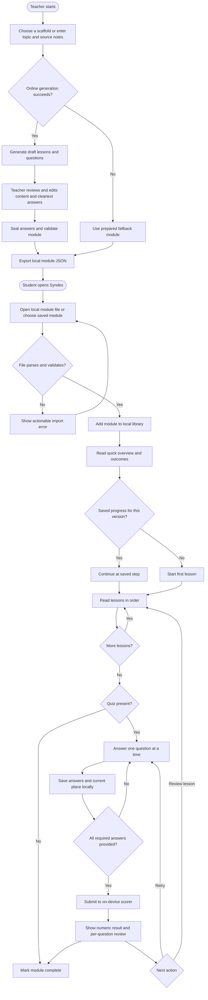
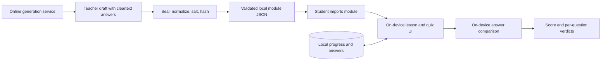

# Syndes proposed system flow

This flowchart combines the proposed learner journey in the [frontend design system](../../frontend/docs/design/design-system.md) with the teacher generation and local scoring paths in the Tauri core. Solid arrows describe the intended user journey; labels call out where a step depends on a condition.

## Data and trust boundary

The learner import, lesson, quiz, and scoring path is intended to work without a connection. Online generation is confined to teacher preparation. The result shows verdicts and points; sealed answer hashes do not provide a displayable answer key.

## Proposal versus current implementation

- **Proposed UI:** Library → overview → lessons 1…N → short quiz → result, with local progress, retry, and review.
- **Available core:** Tauri commands for local module loading and validation, answer checking, submission scoring, sealing, scaffold selection, and generation with a prepared fallback.
- **Still to align:** The current module model has one optional `lesson` field, while the proposed UI describes an ordered multi-lesson sequence. The current generation command seals the draft before returning it, so the depicted teacher review of cleartext answers needs a separate authoring step. The frontend is a starting page, and the screens, local progress storage, and unanswered-question gate are proposed rather than implemented.
