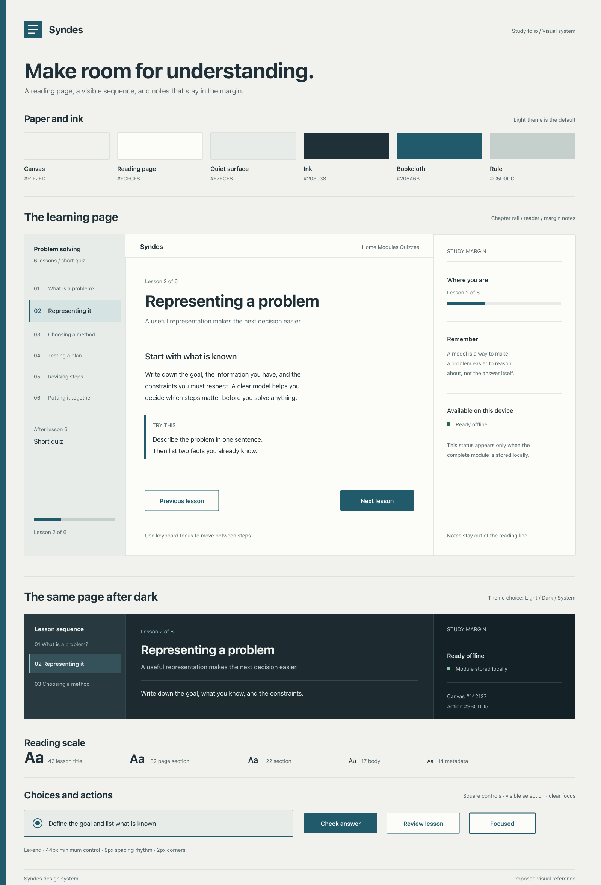

# Syndes design system

The [editable SVG](./design-system.svg) contains the same visual reference. It embeds Lexend; the [font license](./LEXEND-OFL.txt) is included here.

Status: proposed product UI specification. The image illustrates the intended visual language; it does not imply that the current app already implements these screens or states.

## Purpose and principles

Syndes helps students work through local learning modules and quizzes, including when a connection is unreliable. Teachers prepare and review content before students use it. Its visual idea is a **study folio**: a clear lesson sequence beside a generous reading page, with notes and status in the margin. This gives students a sense of place without filling the screen with cards.

- Make the lesson or question the main visual focus. Show one task at a time.
- Give lesson content one steady reading column. Use a narrow chapter rail for place and a separate margin for supporting notes.
- Use muted paper, ink, thin rules, and useful whitespace. Keep reading areas free of glass, glow, and decorative gradients.
- Display **Continue**, **Ready offline**, and connection states only when backed by actual app state.
- Keep navigation and actions labeled. Color, icons, and motion supplement words.
- Support light and dark themes with the same information hierarchy.

## Foundations

### Color and themes

Light is the default theme. Its slightly cool, dirty-white paper avoids the glare of pure white. Dark mode uses blue charcoal and softened text. The single brand accent is a bookcloth blue-green; green and red appear only for semantic feedback.

| Semantic token | Light | Dark | Use |
| --- | --- | --- | --- |
| `--background` | `#F1F2ED` | `#142127` | App canvas |
| `--surface` | `#FCFCF8` | `#1D2B31` | Reading and task page |
| `--surface-muted` | `#E7ECE8` | `#283940` | Chapter rail, notes, and quiet rows |
| `--foreground` | `#203038` | `#EFF3F0` | Primary text |
| `--muted-foreground` | `#53656B` | `#B7C8C9` | Supporting text and metadata |
| `--border` | `#C5D0CC` | `#486168` | Rules, fields, and selected boundaries |
| `--primary` | `#205A6B` | `#9BCDD5` | Main action and active place |
| `--primary-foreground` | `#FFFFFF` | `#12252B` | Text on primary |
| `--success` | `#286749` | `#91CEAA` | Success with a text label |
| `--destructive` | `#A13F3B` | `#EBA6A1` | Error with a text label |
| `--focus` | `#205A6B` | `#9BCDD5` | Keyboard focus outline |

Use semantic tokens so theme changes do not require separate component markup. Check text, border, selected choice, and disabled-state contrast in both themes. Availability and results must remain understandable without color.

### Surfaces, shape, and spacing

| Element | Specification |
| --- | --- |
| Page | Quiet paper canvas; no background texture behind content |
| Reader | Solid `--surface`, one rule at its edge, no floating shadow, 2px radius |
| Chapter rail | `--surface-muted` with a vertical rule; numbered steps reflect the real sequence |
| Margin note | Short, contextual information separated by a rule, not another elevated card |
| Button and field | 2px radius; selected answer row uses a 2px primary border and quiet fill |
| Divider | 1px `--border`; use aligned rules and spacing before adding another container |
| Layout rhythm | 8px base; common gaps of 8, 16, 24, and 32px |

“Boxy” means straight edges with just 2px of corner relief. Avoid pills, floating cards, and shadows. Keep content widths of 56rem for Home and module overview, 72rem for the library, and 44rem for the reader. On wide screens the chapter rail and notes sit outside that 44rem reading measure; on narrow screens they move above and below it.

### Typography

- Self-host **Lexend** for reading and controls, with `ui-sans-serif, system-ui, sans-serif` fallback. The visual sheet embeds the font; the app does not yet bundle it.
- Use 17px body text at about 1.55 line height. Give lesson paragraphs about 1.7 line height and limit reading lines to roughly 62 characters.
- Use 14px metadata, 17px body, 22px section headings, 32px page sections, and 42px lesson or page titles. The lesson title carries the hierarchy; avoid decorative all-caps labels above every heading.
- Keep labels visible above fields and use sentence case for controls and headings.

### Focus and motion

Use a visible 3px `--focus` outline with a 3px offset on keyboard focus. Keep controls at least 44px high; use 56px in large-control mode. Respect `prefers-reduced-motion`, and move focus to the new view heading when a lesson or question changes. Use short, quiet transitions only where they clarify a change. Keep quiz answering and long reading content still.

## Layout and navigation

Use a compact header with the **Syndes** wordmark, visible **Home**, **Modules**, and **Quizzes** routes, and a text-labeled connection or offline status. On narrow screens, place the routes in a Sheet with a labeled close control. Mark the current route visibly and with `aria-current="page"`.

The library uses aligned module rows: subject and title at left, lesson count and availability at right, with a clear open action. Use a two-column layout only when there is room to preserve readable summaries; narrow screens use one column. Search and filters stay above results. A module overview starts with outcomes and the actual lesson sequence. Lessons and quizzes use one task page at a time, with the sequence rail as orientation rather than navigation clutter.

Offer **Light**, **Dark**, and **System** theme choices in settings or a labeled theme menu. Make the selected choice clear without relying on an icon alone. Persist the preference locally and honor the system preference when **System** is selected.

## Component guidance

Use [shadcn/ui](https://ui.shadcn.com/docs/components) as the starting point for accessible structure and states. Apply the folio tokens and 2px radii; a default Card border and shadow should not define every content group. Use [React Bits](https://www.reactbits.dev/get-started/index) only when an action reveals supporting information, such as opening a module outline or completion summary. Keep reading and answering still; provide a reduced-motion path and check performance in the desktop runtime.

| Pattern | Preferred component | Required behavior |
| --- | --- | --- |
| Primary and secondary actions | shadcn/ui Button | Verb-first text; solid primary fill or quiet outline; at least 44px target |
| Module, lesson, and result panels | shadcn/ui Card where needed | Clear header/content structure; 2px corners, no default shadow |
| Search and teacher inputs | shadcn/ui Field, Input, Textarea, Select | Persistent labels, hints, and actionable error text |
| Quiz choice | shadcn/ui Radio Group with Field/label | Entire answer row clickable; checked control plus border/fill change |
| Progress | shadcn/ui Progress | Visible **Lesson N of M** or **Question N of M** text and labeled bar |
| Status | shadcn/ui Badge or Alert | Words such as **Ready offline**, with optional icon or color |
| Navigation and overlays | shadcn/ui Breadcrumb, Tabs, Sheet, Dialog | Visible titles, keyboard access, focus management, labeled close control |
| Context reveal | React Bits Animated Content or Fade Content | Optional after the user opens supporting content; disable motion when requested |

The [shadcn/ui Radio Group guidance](https://ui.shadcn.com/docs/components/base/radio-group) includes clickable choice-card composition. Treat React Bits as presentation, not the source of focus handling, answer state, or offline claims.

## Screen patterns

### Home and library

On Home, show **Continue** first only when saved progress exists, followed by **Open module file**. Keep recent subjects and discovery content lower on the page. The library starts with a title, orientation, labeled search and filters, result count, and aligned module rows. A no-results state offers **Clear filters**. An empty local library offers **Open module file**. Offer **Open module** only when its content exists locally.

### Module overview and lesson

The overview shows the module title, summary, learning outcomes, ordered lessons with time estimates, quiz length, and a prominent **Start module** button. If progress exists, show **Continue module** and resume the saved place. Keep answer controls out of the overview.

Each lesson has **Lesson N of M**, a labeled progress bar, title, readable sections, and **Previous lesson** / **Next lesson**. The last lesson advances to **Start short quiz**. Preserve the learner's place when navigating back.

### Quiz and result

Show one question at a time with **Question N of M**, a labeled progress bar, and radio or text answer controls. Provide **Previous**, **Next**, and **Submit** as applicable. Preserve answers when moving backward and identify unanswered questions before final submission.

After local scoring, show a numeric score, **Scored on this device**, a per-question review with status words, **Retry**, and **Review lesson**. Do not imply that AI grades student work or that an answer hash provides a displayable answer key.

### Flashcards and teacher creation

Flashcards use one large square card with front/back label, count, and explicit **Flip**, **Previous**, and **Next** controls with keyboard support. Card backs need teacher-approved study text or lesson content.

The initial teacher flow is one guided panel: topic and authorized source notes, online **Generate**, review of lessons and questions with teacher-side cleartext answers, then seal/export local JSON. State the connection requirement beside **Generate** and provide a prepared fallback. Accounts, roles, and a teacher dashboard are future work.

## Content and state contract

The intended learner path is **Library → Quick overview → Lessons 1…N → Short quiz → Result**. Save module ID, content version, current step, and student answers locally, with a clear reset path. Mark completion only after the final lesson and, when present, quiz submission. Treat offline availability and connection status as facts from the app.

The production importer and scorer must explicitly support and validate any accepted module shape. Keep teacher-side cleartext answers out of student module views. Hashes in a shipped multiple-choice quiz do not make low-entropy answers tamper-resistant; do not derive flashcard backs from them.
